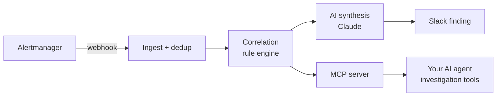

<p align="center">
  
</p>

<h1 align="center">AlertINT</h1>

<p align="center"><strong>Infrastructure Alerts, Decoded</strong></p>

<p align="center">
  <a href="LICENSE"></a>
  <a href="https://github.com/alertint/alertint-agent/releases"></a>
  <a href="https://github.com/alertint/alertint-agent/actions/workflows/ci.yml"></a>
</p>

> AlertINT is a self-hosted, [Fair Source](https://fair.io) agent runtime that turns infrastructure alerts into incident context your AI agent reads directly over MCP.

A single Go binary that sits between Alertmanager and your AI agent. It ingests alert webhooks, correlates them into incidents through an open rule engine, runs an LLM triage skill, posts structured findings to Slack, and exposes the resulting incident state — plus read-only Prometheus access — to any MCP client. Read-only by design. Local state. You bring the LLM key.

**Full documentation: [alertint.com/docs](https://alertint.com/docs)**

## Get started

The **[Quickstart](https://alertint.com/docs/getting-started/quickstart)** is
the canonical walkthrough — install (single binary or bundled Docker Compose
stack), configure, and prove the whole pipeline with one command:

```bash
alertint drill --config config.yaml
```

The built-in incident drill plants a fake deploy, fires a burst of
clearly-marked synthetic alerts through the production ingress, and polls
until triage prints the finding — a causal analysis naming the planted
deploy. From zero to that finding takes about ten minutes; then connect an
MCP client to investigate it, and point Alertmanager at the agent for real
alerts.

## How it works



## Documentation

- **[Docs home](https://alertint.com/docs)** — quickstart, configuration reference
- **[Architecture](https://alertint.com/docs/concepts/architecture)** — how the pipeline is built
- **[Integrations](https://alertint.com/docs/integrations/mcp-clients)** — MCP clients, [Prometheus](https://alertint.com/docs/integrations/prometheus), [Slack](https://alertint.com/docs/notifications/slack)
- **[Scope and limits](https://alertint.com/docs/concepts/scope-and-limits)** — what it will and won't do
- **[FAQ](https://alertint.com/docs/concepts/faq)**

The [`/docs`](docs/) folder in this repo is the canonical source for those pages — the website renders it at build time. Documentation PRs are welcome here; see [`docs/README.md`](docs/README.md) and [CONTRIBUTING.md](CONTRIBUTING.md).

## License

AlertINT is **[Fair Source](https://fair.io)**, licensed under [FSL-1.1-ALv2](LICENSE) (Functional Source License). Free to read, use, modify, and self-host at any scale. The only restriction is offering the software to others as a competing commercial product or service. Each release converts to Apache 2.0 — full open source — two years after publication. See [fsl.software](https://fsl.software) for the license text.
