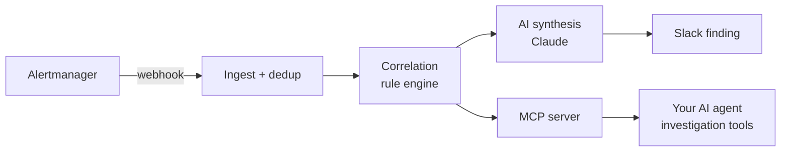

<p align="center">
  
</p>

<h1 align="center">AlertINT</h1>

<p align="center"><strong>Infrastructure Alerts, Decoded</strong></p>

<p align="center">
  <a href="LICENSE"></a>
  <a href="https://github.com/alertint/alertint-agent/releases"></a>
  <a href="https://github.com/alertint/alertint-agent/actions/workflows/ci.yml"></a>
</p>

> AlertINT is a self-hosted, open-core agent runtime that turns infrastructure alerts into incident context your AI agent reads directly over MCP.

A single Go binary that sits between Alertmanager and your AI agent. It ingests alert webhooks, correlates them into incidents through an open rule engine, runs an LLM triage skill, posts structured findings to Slack, and exposes the resulting incident state — plus read-only Prometheus access — to any MCP client. Read-only by design. Local state. You bring the LLM key.

**Full documentation: [alertint.com/docs](https://alertint.com/docs)**

## Quickstart

1. **[Install](https://alertint.com/docs/getting-started/quickstart)** — grab a binary from [Releases](https://github.com/alertint/alertint-agent/releases), or:

   ```bash
   go install github.com/alertint/alertint-agent/cmd/alertint@latest
   ```

2. **[Configure](https://alertint.com/docs/getting-started/configuration)** — copy the example and point it at your env vars:

   ```bash
   cp config.example.yaml config.yaml
   export ALERTINT_WEBHOOK_TOKEN="$(openssl rand -hex 32)" ANTHROPIC_API_KEY="sk-ant-..."
   ```

3. **[Run](https://alertint.com/docs/getting-started/quickstart)** — one process, SQLite state, no other dependencies:

   ```bash
   alertint serve --config config.yaml
   ```

4. **[Point Alertmanager at it](https://alertint.com/docs/getting-started/quickstart)** — add a webhook receiver:

   ```yaml
   webhook_configs:
     - url: "http://<agent-host>:9911/webhook/alertmanager"
   ```

5. **[Connect an MCP client](https://alertint.com/docs/integrations/mcp-clients)** — Claude Code, Cursor, or Windsurf:

   ```text
   http://<agent-host>:9912/mcp
   ```

## How it works



## Documentation

- **[Docs home](https://alertint.com/docs)** — quickstart, configuration reference
- **[Architecture](https://alertint.com/docs/concepts/architecture)** — how the pipeline is built
- **[Integrations](https://alertint.com/docs/integrations/mcp-clients)** — MCP clients, [Prometheus](https://alertint.com/docs/integrations/prometheus), [Slack](https://alertint.com/docs/notifications/slack)
- **[Scope and limits](https://alertint.com/docs/concepts/scope-and-limits)** — what it will and won't do
- **[FAQ](https://alertint.com/docs/concepts/faq)**

The [`/docs`](docs/) folder in this repo is the canonical source for those pages — the website renders it at build time. Documentation PRs are welcome here; see [`docs/README.md`](docs/README.md) and [CONTRIBUTING.md](CONTRIBUTING.md).

## License

[FSL-1.1-ALv2](LICENSE) (Functional Source License). Free to use, modify, and self-host at any scale. The only restriction is offering the software to others as a competing commercial product or service. Each release converts to Apache 2.0 two years after publication. See [fsl.software](https://fsl.software) for details.
