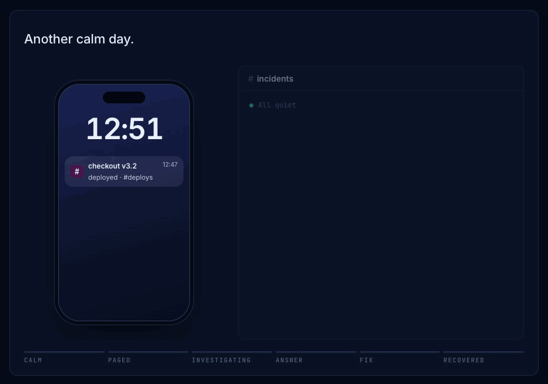

<p align="center">
  
</p>

<h1 align="center">AlertINT</h1>

<p align="center"><strong>Infrastructure incidents, decoded.</strong></p>

<p align="center">
  <a href="LICENSE"></a>
  <a href="https://github.com/alertint/alertint-agent/releases"></a>
  <a href="https://github.com/alertint/alertint-agent/actions/workflows/ci.yml"></a>
  <a href="https://artifacthub.io/packages/helm/alertint-agent/alertint-agent"></a>
</p>

<p align="center">
  <a href="https://alertint.com/docs/getting-started/quickstart">Quickstart</a> ·
  <a href="https://alertint.com/docs">Docs</a> ·
  <a href="https://github.com/alertint/alertint-agent/discussions">Discussions</a> ·
  <a href="#-design-partners-wanted">Design partners wanted</a>
</p>

> AlertINT turns infrastructure alerts into investigated incidents and serves them to the AI tools you already use, over MCP — a self-hosted agent that runs inside your own network.

<p align="center">
  
  <br>
  <sub>Illustrative incident. The services, times and cause are invented.</sub>
</p>

##  How it works

1. **Groups** an alert storm into one Situation.
2. **Investigates** with read-only evidence: recent changes, logs and metrics. A
   [verification round](https://alertint.com/docs/concepts/verification-round)
   challenges the draft before the finding is posted.
3. **Notifies** through an evolving Slack thread or selected ntfy pushes per Situation.
4. **Hands off** the full record to Claude Code, Codex or any MCP client.
   Corrections captured there steer the next triage of the same failure.

Read-only by design. Local state. You bring the LLM key.

##  At a glance

| Area | Supported today |
|---|---|
| **Alert sources** | Alertmanager, Zabbix |
| **Read-only evidence** | Prometheus, Loki, Zabbix, Sentry, change-event webhooks (deploys, config, flags) |
| **Correlation rules** | Open YAML schema, built-in baseline pack, your own local packs |
| **LLM** | Anthropic, or a self-hosted OpenAI-compatible endpoint (vLLM, SGLang, Ollama, LM Studio) |
| **Delivers to** | Slack, ntfy (planned for 0.15), stdout JSON, and MCP clients (Claude Code, Codex, Cursor, Windsurf) |
| **Runs as** | Single Go binary, Docker image, or signed Helm chart |
| **State** | Local SQLite with a hash-chained, verifiable audit log |

##  Get started

Docker Compose bundles AlertINT with Prometheus and Alertmanager:

```bash
git clone https://github.com/alertint/alertint-agent && cd alertint-agent
cp .env.example .env   # set the ALERTINT_* tokens and your LLM key
docker compose -f docker/docker-compose.yaml --env-file .env up
```

Then fire the built-in drill. It plants a fake deploy, sends synthetic alerts
through the real ingress, and prints the finding:

```bash
docker compose -f docker/docker-compose.yaml exec agent \
  /alertint drill --config /etc/alertint/config.yaml
```

Other installs:

- **Kubernetes:** signed Helm chart on Artifact Hub, see the
  [Helm guide](https://alertint.com/docs/getting-started/kubernetes).
- **Binary:** `go install github.com/alertint/alertint-agent/cmd/alertint@latest`

Next, [connect an MCP client](https://alertint.com/docs/integrations/mcp-clients)
and point Alertmanager or
[Zabbix](https://alertint.com/docs/integrations/zabbix) at the agent. The
[Quickstart](https://alertint.com/docs/getting-started/quickstart) walks through
every step.

##  Documentation

- [Quickstart](https://alertint.com/docs/getting-started/quickstart) ·
  [Configuration](https://alertint.com/docs/getting-started/configuration)
- [Architecture](https://alertint.com/docs/concepts/architecture) ·
  [Situation workflow](https://alertint.com/docs/concepts/situation-workflow) ·
  [Incident memory](https://alertint.com/docs/concepts/incident-memory)
- [Integrations](https://alertint.com/docs/integrations/mcp-clients) ·
  [Scope and limits](https://alertint.com/docs/concepts/scope-and-limits) ·
  [FAQ](https://alertint.com/docs/concepts/faq)
- [Changelog](CHANGELOG.md)
- [ntfy notifications](docs/notifications/ntfy.md): configurable mobile updates
  through ntfy.sh or a self-hosted server, independently of Slack. Planned for
  AlertINT 0.15; v0.14.3 does not include this integration.

The [`docs/`](docs/) folder is the source of alertint.com/docs. Documentation
PRs are welcome, see [CONTRIBUTING.md](CONTRIBUTING.md).

##  Design partners wanted

Running Alertmanager or Zabbix in production? We're looking for a few teams to
run AlertINT on a real stack and tell us honestly whether the findings hold up.
[Read what we'd ask](https://github.com/alertint/alertint-agent/discussions/133)
and reply there, or email [ernests@alertint.com](mailto:ernests@alertint.com).

##  Community

- **Questions and ideas:** [GitHub Discussions](https://github.com/alertint/alertint-agent/discussions)
- **Bugs:** [Issues](https://github.com/alertint/alertint-agent/issues/new/choose)
- **Security:** never in public, see [SECURITY.md](SECURITY.md)

##  License

[Fair Source](https://fair.io) under [FSL-1.1-ALv2](LICENSE). Free to use,
modify and self-host at any scale. The only restriction is offering it as a
competing commercial product. Each release becomes Apache 2.0 two years after
publication.
